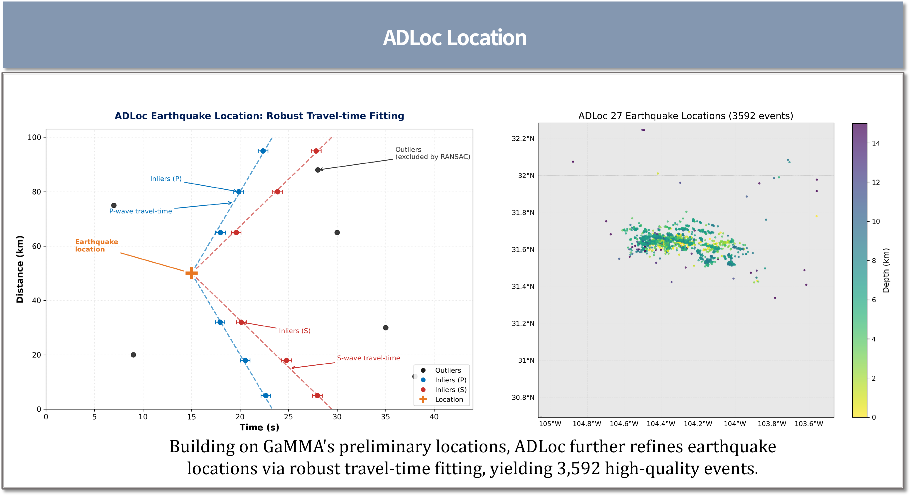

# SeisPipe-DBMA
**Seismic Processing Pipeline with DBMANet, GaMMA & ADLoc**
A modular workflow for automatic phase picking, association, and location of microseismic and local earthquakes.

[](https://www.python.org/downloads/)
[](https://opensource.org/licenses/MIT)

---

##  Overview

**SeisPipe‑DBMA** is an end‑to‑end earthquake location pipeline designed for dense seismic networks. It integrates:

- **DBMANet** – A deep‑learning phase picker based on Dilated Convolutions and Bidirectional Mamba, achieving high sensitivity for P and S arrivals.
- **GaMMA** – A Gaussian Mixture Model‑based associator that robustly links picks to events.
- **ADLoc** – A travel‑time location routine using 2D Eikonal solvers and iterative station‑term corrections.

The pipeline is tailored for the **TexNet** dataset but can be adapted to other networks with minimal configuration.
> ⚠️ **Important**: This repository **does not contain any raw seismic waveform data**. All waveform datasets must be prepared by users.
> Pre‑trained weights (`model_best.pt`) and `config.json` template are already included in the repository.
> The built‑in 1‑D velocity model is derived from the TXED project: https://github.com/aaspip/txed.
> When applying this pipeline to other regions, please replace it with the velocity model suitable for your study area.

---

##  Features
-  Pre‑trained **DBMANet** phase picker (Dilated Convolution + Bidirectional Mamba) with configurable P/S picking thresholds
-  Automatic waveform resampling (e.g. 100 Hz) integrated within picking workflow
-  Standardized phase‑pick output compatible with GaMMA associator
-  GaMMA phase association: DBSCAN‑based clustering, supports 1‑D velocity model
-  ADLoc precise relocation: 2‑D Eikonal solver + iterative SST station‑term corrections
-  Visualization tools: epicenter map, depth histogram, pick statistics, reference‑catalog comparison plots
-  Jupyter‑notebook‑based sequential workflow with clear data dependency between processing stages

---

##  Data Notice

### DBMANet Training with STEAD dataset
- The `DBMANet/` folder contains **only model definition and training scripts**, no raw waveform data.
- Model is trained on the public **STEAD dataset**. Users need to download STEAD dataset by themselves.
- The original STEAD dataset is stored as `merged.hdf5`. **Users need to convert hdf5 waveform records into numpy arrays for model training**.
- STEAD official repository: https://github.com/smousavi05/STEAD

### Continuous waveform for location workflow
- The `location/` directory does **not store waveform files**.
- Complete end‑to‑end workflow is implemented in Jupyter notebooks under the `location/` folder.

### Contents included / not included in repo
- ✅Pre‑trained DBMANet weights: `model_best.pt`
- ✅`config.json` configuration template for GaMMA & ADLoc
- ❌ Raw STEAD hdf5 dataset
- ❌ Example MiniSEED continuous waveform files

> ⚠️ Warning: The phase‑picking function will **in‑place overwrite original MiniSEED waveform files** under `local/texnet/waveforms_27/` after resampling to 100 Hz. Please keep backup of raw waveform data!

---

##  Installation

### Clone the repository
```bash
git clone https://github.com/guoguo-seismic/SeisPipe-DBMA.git
cd SeisPipe-DBMA

### Set up a conda environment (recommended)
```bash
conda create -n seispipe python=3.10
conda activate seispipe
```

### Install dependencies
```bash
pip install -r requirements.txt
```

### Required packages
- `obspy`
- `numpy`, `pandas`, `scipy`
- `torch` (with CUDA if available)
- `mamba‑ssm`
- `cartopy`, `matplotlib`
- `pyproj`
- `gamma` (GaMMA) – install from [https://github.com/AI4EPS/GaMMA](https://github.com/AI4EPS/GaMMA)
- `adloc` – install from [https://github.com/AI4EPS/ADLoc](https://github.com/AI4EPS/ADLoc)

> **Note**: `mamba‑ssm` and `gamma` may require separate installation instructions. Please refer to their official repositories.

---

##  Pipeline Steps

> ⚠️ Before running: Prepare your waveform data, refer to ** Data Notice**.
> The whole workflow is operated via Jupyter notebooks inside the `location/` directory.
> Execute notebooks **in the following order**:
> 1. `prepare_data.ipynb` : Filter catalog & stations, download MiniSEED continuous waveform data.
> 2. `workflow.ipynb` : Run phase picking (using `model_best.pt`), GaMMA association and ADLoc relocation.

1. **Waveform Preparation**
   - Run `location/prepare_data.ipynb`；Input raw TexNet `texnet_events.csv` and `texnet_stations.csv`.
   - Perform time‑space filtering for events and stations.
   - Download MiniSEED waveforms from IRIS, output under `local/texnet/waveforms_27/`.
   - Generate filtered station, event files and project config json.

2. **Phase Picking (DBMANet)**
   - Load the provided pre‑trained weight file `model_best.pt`.
   - Slide a window over continuous waveforms, output P/S probability curves.
   - Extract picks above user‑defined thresholds.

3. **Pick Standardization**
   - Convert DBMANet output to a standard format (`station_id`, `phase_time`, `phase_type`, `phase_score`).

4. **Association (GaMMA)**
   - Use GaMMA to associate picks into events, using generated `local/texnet/config.json`.
   - Requires station geometry and a 1D velocity model.
   - Outputs event catalog and associated picks.

5. **Precise Location (ADLoc)**
   - Relocate events using the 2D Eikonal travel‑time solver with `config.json`.
   - Iteratively estimate station terms.
   - Produce final event locations with residuals.
    <p align="center">
     
   </p>

6. **Visualization & Quality Control**
   - Plot epicenter maps, depth histograms, pick distribution, and comparison with reference catalogs.

---

##  Quick Start (Notebook‑based Workflow)
> This project does **not provide importable python package**.
> Please launch jupyter and run notebooks in `location/` folder sequentially.
> All python scripts / jupyter notebooks **must be executed under repository root directory** (same level as `local` folder and `model_best.pt`).
> Do NOT run scripts inside sub‑folders directly, otherwise file‑not‑found errors will occur.

1. Open jupyter environment
```bash
jupyter notebook
```
2. Open and run notebook in order:
   - `location/prepare_data.ipynb` → Filter catalog, stations, download waveform data
   - `location/workflow.ipynb` → Phase picking(`model_best.pt`) → association → precise relocation

All intermediate results and figures will be automatically generated inside `local/texnet/` folders.

---

##  Input Data Format
> Initial input files for prepare_data.ipynb:
- **Waveforms**: MiniSEED files organized as `YEAR/DOY/NET.STA.LOC.CHAN.mseed` (prepared by `prepare_data.ipynb`)
- **Station file**: CSV with columns: `Network Code`, `Station Code`, `Longitude (WGS84)`, `Latitude (WGS84)`, `Elevation`
- **Event catalog (optional)**: CSV with `time`, `longitude`, `latitude`, `depth_km` for validation

After running `prepare_data.ipynb`, generated inputs for workflow.ipynb:
- **Waveforms**: MiniSEED files stored in `local/texnet/waveforms_27/YEAR/DOY/`; figure: `figures/all_27_stations.png`
- **Station file**: `local/texnet/stations_selected_27.csv`
- **Reference event catalog (for validation)**: `local/texnet/events_filtered.csv`
- **Config**: `local/texnet/config.json` (time range, region, station‑channel settings)

---

##  Outputs
> All outputs are generated under the `local/texnet/` directory by default.

| Step | Output Files |
|------|--------------|
| prepare_data.ipynb (Data Preparation) | `config.json`, `stations_filtered.csv`, `events_filtered.csv`, `stations_selected_27.csv`; MiniSEED waveforms under `waveforms_27/YEAR/DOY/`; figure: `figures/all_27_stations.png` |
| DBMANet Phase picking | `DBMANet_27/DBMANet_picks.csv` or `DBMANet_picks_empty.csv` |
| Pick Standardization | `DBMANet_27/DBMANet_picks_standardized.csv` |
| GaMMA Association | `gamma_27/gamma_events.csv`, `gamma_27/gamma_picks.csv` |
| ADLoc Precise Location | `adloc_27/adloc_events.csv`, `adloc_27/adloc_picks.csv`, `adloc_27/adloc_stations.csv`；SST `adloc_27/adloc_{events,picks,stations}_sst_{0‑7}.csv` |
| Visualization & QC | `adloc_27/figures/adloc_27_comparison.png` |

> Note: ADLoc will generate a large number of SST iteration intermediate CSV files, which is expected behavior. Use `adloc_events.csv` as the final catalog.

---

##  DBMANet Model
DBMANet is a hybrid network combining:
- **Dilated Convolutional Blocks** for multi‑scale feature extraction.
- **Bidirectional Mamba** for long‑range temporal dependency modeling.
- **Stochastic Depth** for regularization.

The model is trained on the **STEAD** dataset (or your own labeled data).
Pre‑trained weight file `model_best.pt` is included in this repository.

> For re‑training: Convert STEAD hdf5 file to numpy array as training input under `DBMANet/` folder.

---

##  Citation

If you use this pipeline in your research, please cite the following:

- **DBMANet**: Fu, C., Guo, K., Liu, J., Zhang, P., Xu, X. *A deep learning package for generalized passive seismic data analysis and event detection*
- **GaMMA**: Zhu, W., McBrearty, I. W., Mousavi, S. M., Ellsworth, W. L., & Beroza, G. C. (2022). *Earthquake phase association using a Bayesian Gaussian mixture model*, Journal of Geophysical Research: Solid Earth, 127(5), e2021JB023249
- **ADLoc**: Zhu, W., Rong, B., Jie, Y., & Wei, S. S. (2025). *Robust Earthquake Location using Random Sample Consensus (RANSAC)*, arXiv:2502.10933

---

##  Contributing

Contributions are welcome! Please open an issue or submit a pull request.

---

##  License

This project is licensed under the MIT License – see the [LICENSE](LICENSE) file for details.

---

##  Acknowledgements

- TexNet for providing the waveform and station data.
- TXED project for the Texas 1‑D velocity model (https://github.com/aaspip/txed).
- The developers of Obspy, PyTorch, Mamba, GaMMA, and ADLoc.

---
